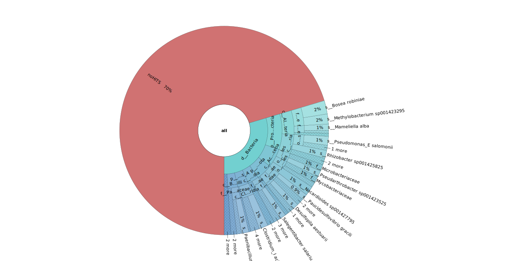
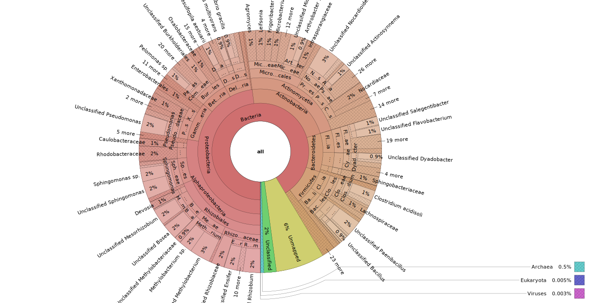
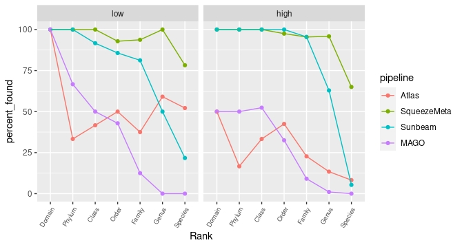
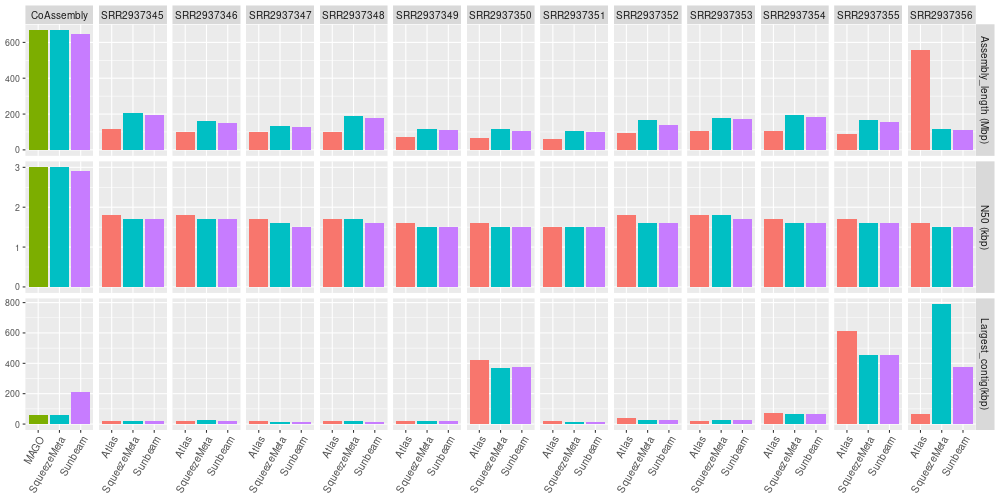
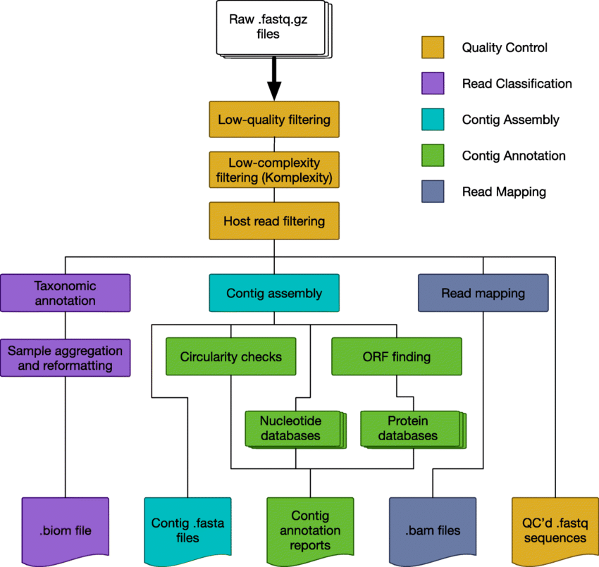

# MetaG_MetaT_investigations
Metagenomic &amp; metatransciptomic coral reaf investigations

# CAMI

CAMI is a database for metagenomics tools comparison providing gold standard assembly and binning results for 3 datasets of different complexities.   
    • High complexity : a sample with numerous genomes and circular elements  
    • Medium complexity : a sample with a large insert size ( 5kb) and in mate-pair   
    • Low complexity :  a sample with small insert size.  

|   LOW   |   MEDIUM     |   HIGH      |
|:-------:|:------------:|:-----------:|
| Sample 1| Sample 1 5kbp|   sample 1  |


### ATLAS to Metaquast 

File used ```SAMPLE/assembly/SAMPLE_final_contigs.fasta```

```metaquast.py -o ./ --min-contig 150 SAMPLE_final_contigs.fasta``` 

### METASQUEEZE to Metaquast

File used ```SAMPLE/results/01.SAMPLE.fasta```

```metaquast.py -o ./ --min-contig 150 01.SAMPLE.fasta``` 

### Pipeline assembly evaluation

**Largest contig** is the length of the longest contig in the assembly.

**Assembly length** is the total number of bases in the assembly.

**N50** is the length for which the collection of all contigs of that length or longer covers at least half an assembly.

 

Logically, we observe an increase of the assembly length with the raise of the complexity.
At the same time, the largest contig length have decreased with the complexity. As have the N50.
These trends are the same for all  pipelines.

Surprisingly, Mago and SqueezeMeta gave metrics quite similare whatever the complexity. 
Mago and SqueezeMeta use different tools to process their assembly (Spade and Megahit). 
It seems the choice of the default option of both pipelines leads to a similar assembly.
 
Notice that Atlas gives the best N50 whatever the complexity.

Finally, we observed Sunbeam gave bad results compared to the others.

# ATLAS binning evaluation

### ATLAS to AMBER

Convert fasta to csv  
```
./convert_bins.py -p ../../../RL/RL-S001--insert-270/binning/DASTool/bins/*maxbin*.fasta -s ../../../RL/RL-S001--insert-270/sequence_alignment/RL-S001--insert-270.sam -o ../../../AMBER/RL/maxbin_bins.tsv

./convert_bins.py -p ../../../RL/RL-S001--insert-270/binning/DASTool/bins/*metabat*.fasta -s ../../../RL/RL-S001--insert-270/sequence_alignment/RL-S001--insert-270.sam -o ../../../AMBER/RL/metabat_bins.tsv
```

From DASTool
```
./convert_bins.py -c ../../../RL/RL-S001--insert-270/binning/DASTool/cluster_attribution.csv -s ../../../RL/RL-S001--insert-270/sequence_alignment/RL-S001--insert-270.sam -o ../../../AMBER/RL/dastool_bins.tsv

```

Add column LENGTH to GS.bining
```
./add_column_length.py -s ../../../RL/data/RL.fastq -g ../../../AMBER/RL/gs_read_mapping.binning -o ../../../AMBER/RL/gs_read_mapping.binning.length
```

Add sample name (CAMI_low) on first line of files used by amber
```
sed -i '1 i\@Version:0.9.1\n@SampleID:CAMI_low\n\n' metabat_bins.tsv
sed -i '1 i\@Version:0.9.1\n@SampleID:CAMI_low\n\n' maxbin_bins.tsv
sed -i '1 i\@Version:0.9.1\n@SampleID:CAMI_low\n\n' gs_read_mapping.binning.length
```
amber  

``` 
amber.py -g gs_read_mapping.binning_strip --ncbi_nodes_file taxdump/nodes.dmp -o ./ maxbin_bins.tsv metabat_bins.tsv
```   
Download taxdump.tar.gz from ftp://ftp.ncbi.nih.gov/pub/taxonomy/taxdump.tar.gz, extract nodes.tmp, and provide it to AMBER with option --ncbi_nodes_file

DAS Tool is an automated method that integrates a flexible number of binning algorithms to calculate an optimized, non-redundant set of bins from a single assembly. We show that this approach generates a larger number of high-quality genomes than achieved using any single tool.
In ATLAS pipeline DAS Tool merge results from Metatabat and Maxbin.

**N.B: Recall = completeness, precision = purity**

LOW                        |  HIGH
:-------------------------:|:-------------------------:
  |  
 |   

We observe that Maxbin is quite better than Metabat on low complexity samples. But Metabat  worked much better once applied to high complexity dataset.  
By merging Metabat and Maxbin results, DAS Tool improves the completeness of the bins.   
/!\ On a low complexity dataset, the completeness of bins is maximized but the contamination is increased too.


### Atlas trouble with medium 

    -> Possibly linked to insert size and mate-pair library 

[Paired-end read confusion - library, fragment or insert size?](http://thegenomefactory.blogspot.com/2013/08/paired-end-read-confusion-library.html)

[Using Velvet with mate-pair sequences](http://thegenomefactory.blogspot.com/2012/09/using-velvet-with-mate-pair-sequences.html)

Mate-pair reads are extremely valuable in a de novo setting as they provide long-range information about the genome, and can help link contigs together into larger scaffolds. They have been used reliably for years on the 454 FLX platform, but used less often on the Illumina platform. I think the main reasons for this are the poorer reliability of the Illumina mate-pair protocol and the larger amount of DNA required compared to a PE library.

We can consider MP reads as the same as PE reads, but with a larger distance between them ("insert size"). But there is one technical difference due to the circularization procedure used in their preparation. PE reads are oriented "opp-in" (L=>.....<=R), whereas MP reads are oriented "opp-out" (L<=.....=>R).

 

Note that in order to use SPAdes 3.1+ for mate-pair only assemblies you need to have the so-called "high quality mate pairs". Right now such mate pairs can only be generated using Nextera mate pair protocol. Everything else would give you suboptimal assemblies.
[MP and SPADE](https://www.biostars.org/p/111202/)

# Pipeline annotation evaluation

### CAMI Profile to Krona

Build txt file for Krona
```
./profile2krona.py -g ../../AMBER/RM/gs_read_mapping_rm1_s002_insert_5000_5gb.binning -p ../../AMBER/RM/goldstandard_medium_2.profile -o medium_taxo
``` 
Install Krona
``` 
singularity run docker://biocontainers/krona:v2.7.1_cv1
```
Launch Krona
```
ktImportText medium_taxo
```

LOW                    |       MEDIUM        |  HIGH
:---------------------:|:-------------:|:------------------:
  |  | 

### Atlas results from CAMI to Krona


```
./atlas2Krona.py -o ../../../Krona/Atlas/low/Atlas-high_krona.taxo -t ../../../atlas/RH/genomes/taxonomy/gtdb/gtdbtk.bac120.summary.tsv -r ../../../atlas/RH/genomes/counts/raw_counts_genomes.tsv -u ../../../atlas/RH/genomes/alignments/unmapped/

```

Launch Krona
```
ktImportText low_krona.taxonomy
```

LOW                    |  HIGH
:---------------------:|:------------------:
   |  | 


### SqueezeMeta results from CAMI to Krona

```
##INSTALL KRONA
git clone https://github.com/marbl/Krona.git
cd Krona/KronaTools
./install.pl
``` 
```
library("SQMtools")

## ./CAMI_high = repository with squeezeM results
CAMI_high = loadSQM('./CAMI_high/', engine = 'data.table')

exportKrona(CAMI_high)
```

LOW                    |        medium      |  HIGH
:---------------------:|:------------------:|:------------------:
 |   |  | 


### CAMI reads unclassified/noHits comparison


### CAMI taxonomy comparison


### Build home metrics to compared Taxonomy 


```
##build metrics from Squeeze Results
./CompareSqeezemeta.py  -g gold.profile -p 11.mcount -n nombre de reads_de_base

``` 

``` 
##build metrics from Atlas Results
./ComparaisonAtlas.py -g -g gold.profile -p gtbdtk.summary.tsv -s raw_count.tsv -n nombre de reads_de_base
```  



% found  = n taxa found by the pipeline / n taxa total of the gold standard  at taxonomic rank


# Public datasets


Coral reefs are highly diverse marine ecosystems increasingly threatened on a global scale.
During the last several decades corals have been in decline and at least one-third of all coral species are now threatened with extinction. The foundation species of reef ecosystems are stony corals that depend on their symbiotic microalgae and bacteria for aspects of their metabolism, immunity, and environmental adaptation.
Knowledge of the diversity and function of marine microbiota has rapidly expanded in recent decades through the emergence of molecular techniques that target relevant phylogentic markers and functional genes. 
Characterizing the taxonomic diversity of microbial communities is one of the primary objectives of metagenomic studies.
Corals form close associations with a complex consortium of microorganisms, including Symbiodinium (zooxanthellae), Fungi, endolithic algae, Bacteria, Archaea, and viruses. This collective group of organisms is referred to as the coral holobiont.(Rohwer et al., 2002; Reshef et al., 2006).
Investigations lead on CAMI datasets, reveal that taxonomic assignation is a very challenging field. Thanks to 4 different metagenomics pipelines (Atlas, SqueezeMeta, Sunbeam, MAGO) we gripped different bioinformatics tools used in keys steps of metagenomics methodologies to analyze the data obtained from the shotgun sequencing. 
From now on we can drive analysis adapted on publics coral reef libraries in order to describe with accuracy the coral holobiont community. 


### Coral reef metagenomic 

https://www.ncbi.nlm.nih.gov/sra/SRX1440049[accn


```
### SRA_sample2download.txt ###
SRR2937350
SRR2937346
SRR2937345
SRR2937356
SRR2937355
SRR2937354
SRR2937353
SRR2937352
SRR2937351
SRR2937349
SRR2937348
SRR2937347
```

```
## download data
for i in $(cat ../../SRA_sample2download.txt); do echo $i; ./fasterq-dump --concatenate-reads -O ../../sra_raw/ -p -t ../../tmp2 $i; done

## output interleaved-fastq
for f in $(find ../../data_coral/sra_raw -type f);do  echo $f ; ./SRA_2interleaved_fastq.py -f  $f  -o ../../data_coral/  ; done

## output PE fastq
for f in $(find ../../data_coral/sra_raw -type f);do  echo $f ; ./separate_reads.py -f $f  -o ../../squeezemeta/coral_data/fastqs/ ; done

``` 
 
Instrument : Illumina Hi2500  
Strategy : WGS  
Layout: PE  

### Quality control


### Mapping vs cnidaria reference

As a first step, we removed cnidarian read pairs using mapping against a collection of sequences and genomes belonging to the NCBI taxonomy ID 6073 (Cnidaria) deposited in the database. (Cárdenas A & al. 2020)
Regarding mapping results, 8% of reads from shotgun publics coral reef libraries seems to come from cnidarian origin.

Download reference genome sequence from taxonomy ID
```
esearch -db taxonomy -query "txid6073[Organism:exp]"|elink -target nuccore|efilter -query "refseq"|efetch -format fasta > ref.fa
``` 

Cnidaria = txid6073[Organism:exp]

### Assembly

The initial steps in metagenomic data analysis involve the assembly of DNA sequence reads into contiguous consensus sequences (contigs). Assembly of each SRA accession library is processed with the 2 assembly tools (Spade & Megahit) respectively used in our 4 pipelines. 
SqueezeMeta also gives access to a coassembly mode: with this option reads from all SRA samples are pooled and a single assembly is performed. Base on the SqueezeMeta coassembly approach we investigate the effect of merging libraries before running pipelines compared to a sequential assembly of each library.

Assembly results are shown bellow.




### Taxonomic assignation

#### Zoom on Chlorobiaceae family

The firsts observations of results, highlight the presence of the Chlorobiaceae family.
The tree below allows the appreciation of the diversity in Chlorobiaceae annotations in the 3 databases.  
On right, you can observe the taxonomic assignation results of each pipeline.  
Notice that, the green bars represent the top hit obtained with each pipeline on the Chlorobiaceae family.


After a short investigation, sp003 annotated in GTDB (Atlas DB) is associated with Prosthecochloris marina, the top hit of squeezeMeta.  It gives us real confidence in this result.  

https://gtdb.ecogenomic.org/genomes?gid=GCF_003182595.1  

https://www.ncbi.nlm.nih.gov/assembly/GCF_003182595.1/  

Furthermore, we found out that the bacteria Prosthecochloris marina has been described in the South China Sea, close to our sample extraction. Another good new !  
Bryantseva, I.A., Tarasov, A.L., Kostrikina, N.A. et al. Prosthecochloris marina sp. nov., a new green sulfur bacterium from the coastal zone of the South China Sea. Arch Microbiol 201, 1399–1404 (2019). https://doi.org/10.1007/s00203-019-01707-y  

Finally, s_chlorobium_phaeobacteroide find out by our 3 pipelines can also be considered as a good candidate. And could testify to a chlorobiaceae diversity in this coral reef environment.

### Coral reef metatranscriptomic

    Montipora capitata meta-transcriptome sequencing during thermal stress

https://www.ncbi.nlm.nih.gov/Traces/study/?acc=SAMN17531896&o=acc_s%3Aa


### Design
M. capitata Field sample nubbins were collected on 30 May 2019. At the time of collection, each nubbin was transferred to a Whirl-pak under water, the water was drained from the Whirl-pak, and then flash-frozen in liquid nitrogen. The Qiagen AllPrep DNA/RNA/miRNA Universal Kit was used to isolate RNA, the TruSeq RNA Sample Preparation Kit v2 (Illumina) was used to prepare strand specific cDNA libraries. The protocol included poly-A selection; quality control was done using an Agilent Bioanalyer and a Thermo Fisher Qubit dsDNA BR (Broad Range) assay kit.


Instrument: Illumina NovaSeq 6000  
Strategy: RNA-Seq  
Source: METATRANSCRIPTOMIC  
Selection: cDNA  
Layout: PAIRED  
Location : A coral colony from the north end of Coconut Island\, Kneohe Bay\, Hawaii  


# Metagenomic

## Atlas workflow


## Sunbeam workflow



## mOTU2 an alternative for taxonomic assignation


## Comparison between workflow


# Metatranscriptomic

## Metatrans workflow


## Samsa2 workflow


# Useful Links
[structure Tara Ocean](http://ocean-microbiome.embl.de/companion.html)  
[prodigal Fast, reliable protein-coding gene prediction for prokaryotic genomes.](https://github.com/hyattpd/Prodigal)  
[Atlas](https://github.com/metagenome-atlas/atlas)  
[Metagenomic assembly tools](https://academic.oup.com/view-large/206266243)
